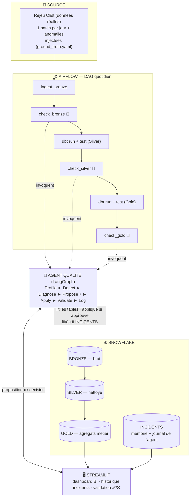
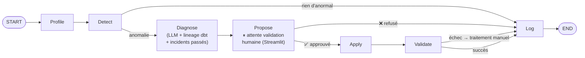

# Plateforme de Qualité de Données Auto-Adaptative sous Contrôle Humain

> *« Une IA qui rend la qualité de données auto-adaptative — l'agent détecte, diagnostique et propose ;
> l'humain décide ; tout est tracé. »*

Pipeline **Medallion** (Bronze / Silver / Gold) sur Snowflake, doté d'un **agent IA** (LangGraph) qui
**détecte, diagnostique et propose la correction** des problèmes de qualité de données — en s'adaptant
aux évolutions de schéma et aux anomalies sémantiques. **Aucune correction n'est appliquée sans
validation humaine explicite**, et chaque incident laisse une **trace complète**.

**Contexte** — Stage Data Engineering · Entreprise : Tython · Rôle : Data Engineer Intern

---

## 🚧 Statut

**Phase 0/9 — Fondations & accès.** Le projet est en cours d'amorçage.

Ce README décrit la **cible**. Les commandes ci-dessous ne sont pas toutes opérationnelles aujourd'hui —
voir [Avancement](#avancement) pour ce qui existe réellement. Le contrat fonctionnel fait foi :
[`CAHIER_DES_CHARGES.md`](CAHIER_DES_CHARGES.md) (v4).

---

## Le problème en 30 secondes

Vos ventes par ville sont fausses. Pas à cause d'un bug, ni d'une donnée manquante — et le cas est
**réel**, tiré du dataset e-commerce Olist utilisé par ce projet :

| ville | ventes |
|--------|--------|
| sao paulo | 1 240 |
| são paulo | 890 |

Le total São Paulo est doublement compté. Et pourtant :

- `not_null` → ✅ passe
- `unique` → ✅ passe
- le typage → ✅ passe
- **le pipeline est vert.**

Aucune règle statique ne casse, parce qu'aucune règle n'est violée. Pour qu'un test attrape ça, il aurait
fallu qu'un humain sache déjà que le problème existe — auquel cas il l'aurait corrigé, pas testé.

**C'est le trou que ce projet comble.**

---

## Ce que fait le projet

Le projet se tient sur **deux jambes complémentaires** :

### 1. Qualité auto-adaptative — le moteur

L'agent n'exécute pas des règles figées. Il **profile** les données, **détecte** les dérives (schéma +
statistiques + sémantique) par comparaison à l'historique, **génère dynamiquement** de nouvelles règles
dbt, et **réutilise** les incidents passés (mémoire).

### 2. Contrôle humain systématique — la couche de sûreté

Aucune IA ne modifie des données sans qu'un humain l'ait approuvé. Le graphe de l'agent ne contient
**aucun chemin** entre le diagnostic et l'application qui ne passe par une **pause de validation
humaine** (`interrupt` LangGraph). La garantie n'est pas une configuration : c'est la **topologie du
graphe** — et elle est prouvée par test.

> **dbt test et l'agent ne sont pas concurrents.** dbt test est un *capteur* : il vérifie une règle déjà
> écrite. L'agent est le *cerveau* : il décide quelles règles doivent exister, pourquoi une a cassé, et
> quoi proposer. L'agent **écrit** les dbt tests ; dbt les exécute. Le raisonnement complet :
> [`docs/DESIGN.md` §1](docs/DESIGN.md).

---

## Architecture en un coup d'œil



Le graphe de l'agent — **toute correction exige une validation humaine** (aucune action autonome) :



**Propriétés clés** : le **graphe** contrôle le flux ; le **LLM n'est appelé que dans `Diagnose`**, sur
des **statistiques agrégées et métadonnées** — jamais sur les lignes brutes ; et **`Apply` est
inatteignable sans approbation humaine** — structurellement.

Détail complet : [`docs/ARCHITECTURE.md`](docs/ARCHITECTURE.md).

---

## Démarrage rapide

### Prérequis

| Besoin | Version / note |
|--------|----------------|
| Python | ≥ 3.11 |
| [`uv`](https://github.com/astral-sh/uv) | gestionnaire d'environnement |
| Compte Snowflake | ⚠️ voir [la question du trial](ROADMAP.md#️-à-régler-dès-maintenant--la-fenêtre-snowflake) |
| Clé LLM | Groq (gratuit, recommandé) ou Google AI Studio / Snowflake Cortex |
| Docker | pour Airflow en local |

### Installation

```bash
git clone <repo>
cd projet_hoda

make setup                 # environnement Python + dépendances figées
cp .env.example .env       # puis renseigner les secrets
```

### Vérifier les accès

Avant toute chose — cette commande dit en une exécution si l'environnement est utilisable :

```bash
python scripts/check_access.py
# ✅ Snowflake  ✅ LLM (Groq)
```

### Préparer le jeu de données (hybride : réel + injection)

```bash
kaggle datasets download olistbr/brazilian-ecommerce -p data/olist   # dataset réel (~100k commandes)
python -m data.replay --from 2017-03-01 --to 2017-05-29 --seed 42    # rejeu jour par jour + injection
```

Rejoue le dataset **réel** Olist un jour à la fois, en y injectant des anomalies contrôlées et
documentées dans `data/ground_truth.yaml` — la vérité terrain contre laquelle le benchmark est calculé.
Le fil rouge sémantique (`sao paulo`/`são paulo`), lui, est déjà dans les données : il n'est pas fabriqué.

### Lancer le pipeline

```bash
# Pipeline seul (baseline : dbt tests statiques, sans IA)
airflow dags trigger medallion_pipeline

# Pipeline + agent qualité
airflow dags trigger medallion_pipeline --conf '{"agent_enabled": true}'
```

### Ouvrir l'observabilité et la validation

```bash
streamlit run streamlit/app.py
```

---

## Le scénario de démonstration

Toute la démo tourne autour d'**un seul incident** — et démontre O1→O8 d'un coup :

| # | Étape | Ce qui est démontré |
|---|-------|---------------------|
| 1 | Les ventes par ville sont fausses (`sao paulo` / `são paulo`) — invisible aux règles statiques | La limite de la baseline |
| 2 | L'agent **détecte** l'anomalie sémantique | Qualité auto-adaptative (O2) |
| 3 | `Diagnose` : pas d'antécédent dans `INCIDENTS` ; le lineage désigne la **normalisation manquante en Silver** | Mémoire (O7) + cause racine (O8) |
| 4 | Propose la normalisation de `city` en Silver + impact estimé (n tables Gold) — le graphe **se met en pause** | HITL structurel (O5) |
| 5 | Validation humaine dans Streamlit : anomalie, cause, correction, impact → ✅ Approuver | Décision éclairée (O4, O5) |
| 6 | Reprise → correction appliquée → `Validate` re-profile → agrégats corrigés | Boucle complète |
| 7 | Incident complet **journalisé dans `INCIDENTS`**, visible dans Streamlit | Traçabilité |
| 8 | *(Bis)* La même anomalie réinjectée : l'agent **cite l'incident précédent** | L'agent apprend (O7) |

Rejouable à la souris depuis Streamlit, sans terminal.

---

## Structure du dépôt

```
ingestion/          # scripts Python multi-sources → Bronze
dbt/                # projet dbt (models/bronze, silver, gold) + tests
agent/              # graphe LangGraph : nodes, tools, state
airflow/dags/       # DAGs d'orchestration
streamlit/          # UI : dashboard BI, incidents, validation HITL
data/               # rejeu Olist + injecteur d'anomalies + ground_truth.yaml
benchmarks/         # résultats baseline vs agent
scripts/            # utilitaires (check_access)
tests/              # tests unitaires (LLM mocké) + les 3 tests de preuve
docs/
  ├── ARCHITECTURE.md
  ├── DESIGN.md
  └── adr/          # décisions d'architecture
```

---

## Documentation

| Document | Répond à |
|----------|----------|
| [`CAHIER_DES_CHARGES.md`](CAHIER_DES_CHARGES.md) | **Quoi** et **pourquoi** — le contrat (v4) |
| [`ROADMAP.md`](ROADMAP.md) | **Dans quel ordre** et **quand c'est fini** |
| [`docs/ARCHITECTURE.md`](docs/ARCHITECTURE.md) | **Comment c'est structuré** — composants et flux |
| [`docs/DESIGN.md`](docs/DESIGN.md) | **Pourquoi ces choix** — mécanismes et arbitrages |
| [`CONTRIBUTING.md`](CONTRIBUTING.md) | **Comment travailler dessus** |
| [`docs/adr/`](docs/adr/) | Décisions structurantes, une par fichier |

---

## Stack technique

| Domaine | Outil |
|---------|-------|
| Ingestion | Python (`requests`, `pandas`) — CSV / JSON / API / PostgreSQL |
| Stockage & requêtage | **Snowflake** (Bronze / Silver / Gold + `INCIDENTS`) |
| Transformation & tests | **dbt** (`dbt-snowflake`) + dbt tests |
| Orchestration | **Airflow** |
| Agent (raisonnement) | **LangGraph** — `StateGraph`, conditional edges, `interrupt` |
| Tools / prompts / parsing | **LangChain** — `@tool`, `PromptTemplate`, `PydanticOutputParser` |
| LLM | **Groq** (recommandé) / Google AI Studio / **Snowflake Cortex** (zéro-fuite) |
| Mémoire & journal | Table `INCIDENTS` (Snowflake) — 🔸 extension : Chroma (RAG vectoriel) |
| Persistance agent | LangGraph Checkpointer (`SqliteSaver`) |
| Observabilité & HITL | **Streamlit** |
| Journalisation externe | 🔸 extension : **GitHub** via serveur **MCP** |
| CI | 🔸 extension : **GitHub Actions** |
| Données | Dataset réel **Olist** (Kaggle) rejoué jour par jour + injection contrôlée d'anomalies |

---

## Avancement

| Phase | Contenu | Statut |
|-------|---------|--------|
| 0 | Fondations & accès | 🚧 en cours |
| 1 | Dataset hybride : Olist rejoué + anomalies injectées | ⬜ |
| 2 | Pipeline Medallion sans agent (baseline) | ⬜ |
| 3 | Squelette agent LangGraph (7 nœuds, pause/reprise) | ⬜ |
| 4 | Agent branché au pipeline + `INCIDENTS` (mémoire) | ⬜ |
| 5 | HITL complet : `interrupt`, reprise, `Apply` borné | ⬜ |
| 6 | Observabilité Streamlit | ⬜ |
| 7 | 🌟 Cause racine (lineage) + extensions (RAG, GitHub/MCP, CI, streaming) | ⬜ |
| 8 | Benchmark chiffré | ⬜ |
| 9 | Documentation, ADR, soutenance | ⬜ |

**Point de bascule** : à la fin de la phase 6, le projet est *soutenable*. La phase 7 est du bonus.

---

## Limites connues

Assumées et documentées — un projet qui dit lui-même où il est faible se défend mieux que celui qui
attend qu'on le lui dise :

- **La détection sémantique n'est pas générale.** Elle vise la classe d'anomalies du `ground_truth.yaml`.
- **Le LLM n'est pas déterministe.** Chaque mesure du benchmark est répétée ≥ 3 fois (moyenne + écart-type).
- **Les anomalies injectées sont synthétiques**, donc plus propres que le réel — mais les anomalies
  sémantiques du fil rouge (variantes de villes) sont, elles, réellement présentes dans Olist.
- **Aucune correction automatique, nulle part** — par conception, pas par manque de temps : chaque
  application passe par un humain. Le prix est la latence de correction ; le raisonnement complet est
  dans [`docs/DESIGN.md` §5](docs/DESIGN.md).
- **Le taux d'approbation est mesuré avec un seul validateur** (l'auteur) — biais à nommer.
- **Volumétrie de POC** (~100k lignes), pas un système à l'échelle.
- **Le catalogue externe (OpenMetadata) est une perspective**, non codé — un lineage interne minimal
  reconstruit depuis le `manifest.json` de dbt suffit.

---

## Licence & contexte

Projet réalisé dans le cadre d'un stage Data Engineering — **Tython**. Cahier des charges v4.
