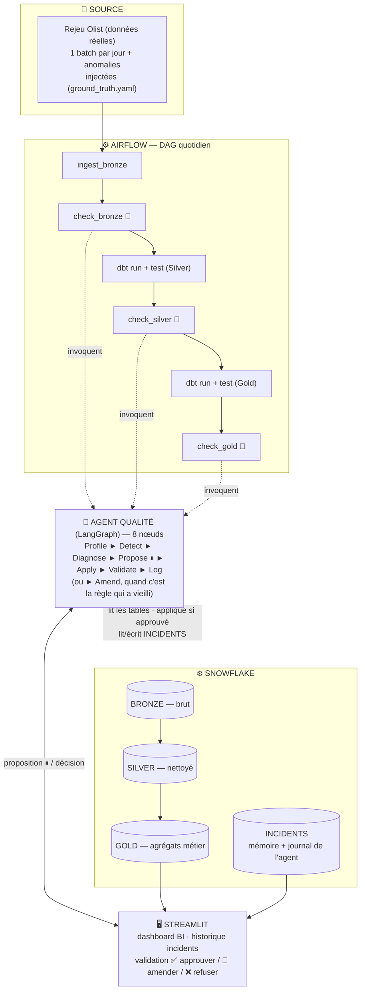
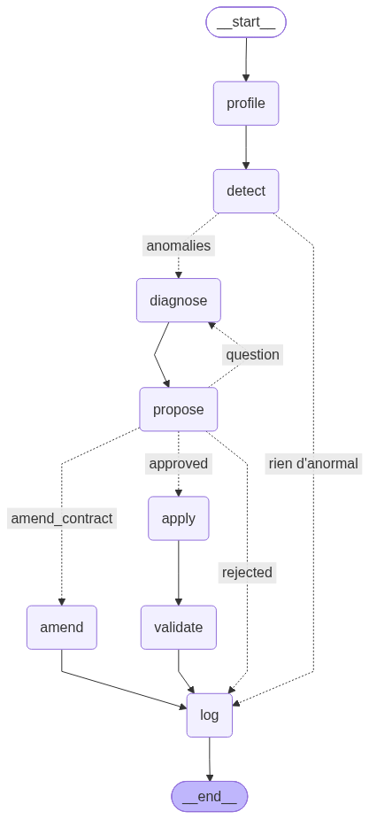

# Plateforme de Qualité de Données Auto-Adaptative sous Contrôle Humain

> *« Une IA qui rend la qualité de données auto-adaptative — l'agent détecte, diagnostique et propose ;
> l'humain décide ; tout est tracé. »*

Pipeline **Medallion** (Bronze / Silver / Gold) sur Snowflake, doté d'un **agent IA** (LangGraph) qui
**détecte, diagnostique et propose la correction** des problèmes de qualité de données — en s'adaptant
aux évolutions de schéma et aux anomalies sémantiques. **Aucune correction n'est appliquée sans
validation humaine explicite**, et chaque incident laisse une **trace complète**.

**Contexte** — Stage Data Engineering · Entreprise : Tython · Rôle : Data Engineer Intern

---

## 🚧 Statut

**Phases 0 → 6 livrées côté code · arrêt provisoire à la 6** *(2026-08-21)*. Le pipeline, l'agent, le
HITL complet et les six écrans Streamlit existent et sont couverts par **710 tests verts**.

Ce qui reste avant que la phase 6 soit formellement close **ne s'écrit pas, cela s'exécute** : le DAG à
11 tâches, le rejeu de la fenêtre avec injections, les trois scénarios bout en bout et l'enchaînement
de la démo — tous demandent Snowflake et Airflow actifs. Le détail est dans
[`PROGRESS.md`](PROGRESS.md#-arrêt-provisoire-à-la-fin-de-la-phase-6-décidé-le-2026-08-21).

Les phases 8 (benchmark) et 9 (soutenance) restent à faire ; la 7 (cause racine) est en pause.
Le contrat fonctionnel fait foi : [`CAHIER_DES_CHARGES.md`](CAHIER_DES_CHARGES.md) (v4).

---

## Le problème en 30 secondes

Vos ventes par ville sont fausses. Pas à cause d'un bug, ni d'une donnée manquante — et le cas est
**réel**, tiré du dataset e-commerce Olist utilisé par ce projet :

| ville | ventes |
|--------|--------|
| sao paulo | 1 240 |
| são paulo | 890 |

Le total São Paulo est doublement compté. Et pourtant :

- `not_null` → ✅ passe
- `unique` → ✅ passe
- le typage → ✅ passe
- **le pipeline est vert.**

Aucune règle statique ne casse, parce qu'aucune règle n'est violée. Pour qu'un test attrape ça, il aurait
fallu qu'un humain sache déjà que le problème existe — auquel cas il l'aurait corrigé, pas testé.

**C'est le trou que ce projet comble.**

---

## Ce que fait le projet

Le projet se tient sur **deux jambes complémentaires** :

### 1. Qualité auto-adaptative — le moteur

L'agent n'exécute pas des règles figées. Il **profile** les données, **détecte** les dérives (schéma +
statistiques + sémantique) par comparaison à l'historique, **génère dynamiquement** de nouvelles règles
dbt, et **réutilise** les incidents passés (mémoire).

### 2. Contrôle humain systématique — la couche de sûreté

Aucune IA ne modifie des données sans qu'un humain l'ait approuvé. Le graphe de l'agent ne contient
**aucun chemin** entre le diagnostic et l'application qui ne passe par une **pause de validation
humaine** (`interrupt` LangGraph). La garantie n'est pas une configuration : c'est la **topologie du
graphe** — et elle est prouvée par test.

> **dbt test et l'agent ne sont pas concurrents.** dbt test est un *capteur* : il vérifie une règle déjà
> écrite. L'agent est le *cerveau* : il décide quelles règles doivent exister, pourquoi une a cassé, et
> quoi proposer. L'agent **écrit** les dbt tests ; dbt les exécute. Le raisonnement complet :
> [`docs/DESIGN.md` §1](docs/DESIGN.md).

---

## Architecture en un coup d'œil


```mermaid
graph TB
    subgraph SRC["📁 SOURCE"]
        GEN["Rejeu Olist (données réelles)<br/>1 batch par jour + anomalies<br/>injectées (ground_truth.yaml)"]
    end

    subgraph AF["⚙️ AIRFLOW — DAG quotidien"]
        T1["ingest_bronze"] --> T2["check_bronze 🤖"]
        T2 --> T3["dbt run + test (Silver)"] --> T4["check_silver 🤖"]
        T4 --> T5["dbt run + test (Gold)"] --> T6["check_gold 🤖"]
    end

    subgraph SF["❄️ SNOWFLAKE"]
        BR[("BRONZE — brut")] --> SI[("SILVER — nettoyé")] --> GO[("GOLD — agrégats métier")]
        INC[("INCIDENTS<br/>mémoire + journal de l'agent")]
    end

    AG["🤖 AGENT QUALITÉ (LangGraph) — 8 nœuds<br/>Profile ► Detect ► Diagnose ► Propose ⏸ ► Apply ► Validate ► Log<br/>(ou ► Amend, quand c'est la règle qui a vieilli)"]

    UI["🖥️ STREAMLIT<br/>dashboard BI · historique incidents<br/>validation ✅ approuver / 📝 amender / ❌ refuser"]

    GEN --> T1
    T2 & T4 & T6 -.->|invoquent| AG
    AG <-->|"lit les tables · applique si approuvé<br/>lit/écrit INCIDENTS"| SF
    AG <-->|"proposition ⏸ / décision"| UI
    GO --> UI
    INC --> UI
```

Le graphe de l'agent — **8 nœuds**, et **toute correction exige une validation humaine** (aucune action
autonome) :



> Ce schéma est **extrait du graphe compilé**, pas dessiné à la main :
> `uv run python -m scripts.export_graph` le régénère depuis le code. Il ne peut donc pas décrire un
> agent qui n'existe plus. Les flèches en pointillés sont les branches conditionnelles ; leur libellé
> est le vocabulaire exact qu'emploient `INCIDENTS` et `scripts/decide.py`.

Les trois **décisions** possibles — c'est la distinction entre les deux « non » qui empêche le contrat
de vieillir :

| Décision | Ce que ça veut dire | Effet |
|---|---|---|
| ✅ `approved` | la donnée est fausse | `Apply` corrige **les données** |
| 📝 `amend_contract` | la donnée est juste, la règle a vieilli | `Amend` passe le contrat en v2 — **aucune écriture** sur les données |
| ❌ `rejected` | cas isolé, rien à changer | `Log` seul ; la signature est mise en silence |

**Et une quatrième réponse qui n'est pas une décision : `question`.** Avant de trancher, on peut
demander à comprendre — la question repart à `Diagnose`, la réponse revient, et la proposition attend
de nouveau :

```bash
uv run python -m scripts.decide <run> ask "pourquoi le job amont plutôt qu'un changement métier ?"
uv run python -m scripts.decide <run> approve --by hoda
```

C'est la seule branche du graphe qui **remonte**, et elle répond à la faiblesse connue du HITL : un
humain à qui on ne laisse que trois boutons approuve vite et mal. Le dialogue est conservé dans
`INCIDENTS` — on peut donc montrer non pas « l'humain a approuvé », mais « l'humain a posé deux
questions, obtenu ces réponses, **puis** approuvé ». **Discuter ne rapproche pas de l'écriture** : dix
questions n'ouvrent pas `Apply`, et un test le vérifie.

**Propriétés clés** — toutes **structurelles**, pas déclaratives :

- le **graphe** contrôle le flux ; le **LLM n'est appelé que dans `Diagnose`**, sur des **statistiques
  agrégées et métadonnées** — jamais sur les lignes brutes ;
- **`Apply` est inatteignable sans approbation humaine** — une seule arête y entre, et `Amend` n'y mène
  pas : amender une règle ne donne aucun droit d'écriture sur les données ;
- **`Log` est la sortie unique** — aucun run ne peut se terminer sans laisser de trace ;
- **l'agent n'invente jamais une valeur** : il isole, met à NULL, exclut d'un agrégat — il ne devine
  pas (`8000` → `80`). Une substitution devinée est rejetée par `Apply` *même après approbation*.

L'agent est **générique** : aucun nom de table ni de colonne n'est écrit en dur. Brancher un nouveau
dataset = écrire un `datasets/<nom>.yaml`, sans toucher au code.

Détail complet : [`docs/ARCHITECTURE.md`](docs/ARCHITECTURE.md).

---

## Démarrage rapide

### Prérequis

| Besoin | Version / note |
|--------|----------------|
| Python | ≥ 3.11 |
| [`uv`](https://github.com/astral-sh/uv) | gestionnaire d'environnement |
| Compte Snowflake | ⚠️ voir [la question du trial](ROADMAP.md#️-à-régler-dès-maintenant--la-fenêtre-snowflake) |
| Clé LLM | Groq (gratuit, recommandé) ou Google AI Studio / Snowflake Cortex |
| Docker | pour Airflow en local |

### Installation

```bash
git clone https://github.com/hodamounaouir/PFA.git
cd PFA

make setup                 # uv sync + crée .env depuis .env.example s'il manque
```

Puis remplis `.env` (identifiants `SNOWFLAKE_*`, `GROQ_API_KEY`).

> ⚠️ **Enregistre `.env` en LF, pas en CRLF.** Sous Windows, un `\r` parasite se glisse dans les
> valeurs Snowflake et la connexion échoue avec une erreur qui ne dit pas pourquoi.
> VS Code : coin bas-droit → `CRLF` → `LF` → sauvegarde.

### Vérifier les accès

Avant toute chose — cette commande dit en une exécution si l'environnement est utilisable :

```bash
uv run python scripts/check_access.py
# ✅ Snowflake  ✅ LLM (Groq)
```

Puis créer la base et ses quatre schémas — **idempotent**, il se relance sans risque (ADR 001 : c'est
ce qui permet de repartir d'un trial neuf sans rien faire à la main dans la console) :

```bash
uv run python scripts/setup_snowflake.py
# 🎉 Base DATA_QUALITY prête — RAW · STAGING · MARTS · OPS
```

### Préparer le jeu de données (hybride : réel + injection)

```bash
kaggle datasets download olistbr/brazilian-ecommerce -p data/olist --unzip   # ~100k commandes
uv run python -m data.replay --from 2018-03-01 --to 2018-05-31 --seed 42     # 92 jours, 1 jour = 1 batch
```

> La fenêtre `2018-03-01 → 2018-05-31` est **figée** dans [`data/config.py`](data/config.py) : c'est le
> plateau stable du dataset, et le `ground_truth.yaml` y est indexé. Un jour hors fenêtre est refusé.
> `data/olist/` n'est pas versionné — les CSV Kaggle sont à copier à la main sur chaque machine.

Rejoue le dataset **réel** Olist un jour à la fois, en y injectant des anomalies contrôlées et
documentées dans `data/ground_truth.yaml` — la vérité terrain contre laquelle le benchmark est calculé.
Le fil rouge sémantique (`sao paulo`/`são paulo`), lui, est déjà dans les données : il n'est pas fabriqué.

### Lancer le pipeline

Le cycle **Découverte** tourne une fois par table, avant toute surveillance : il profile la base et
propose un contrat par table. Les 17 contrats d'Olist sont déjà versionnés dans `contracts/olist/` —
mais tous en `status: proposed`.

```bash
uv run python -m scripts.discover olist --list                        # où en est chaque contrat
uv run python -m scripts.discover olist --approve RAW.CUSTOMERS --by <ton-nom>
```

> ⚠️ **Un contrat `proposed` ne gouverne rien.** `loader.charger()` ne le rend jamais : tant qu'il
> n'est pas signé, aucune de ses clauses ne sert à la détection. Ce n'est pas un oubli, c'est P3 — la
> machine propose, l'humain signe. Le fil rouge São Paulo n'en dépend pas (la famille sémantique lit le
> **rôle du profil**, pas le contrat), mais les familles `contrat` (nulls J60, doublons J75) restent
> muettes tant que rien n'est approuvé.

Ensuite, le pipeline. Airflow orchestre **tout** — depuis la phase 4.5 le DAG compte 11 tâches et
l'agent y tourne après chaque couche, sans option à passer :

```bash
cd airflow
docker compose up -d                       # UI : http://localhost:8080 — airflow / airflow
```

Puis le backfill de la fenêtre — la procédure complète, les deux options et les pièges sont dans
[`airflow/README.md`](airflow/README.md).

L'agent seul, **sans Docker**, sur une couche et un jour :

```bash
uv run python -m scripts.check_layer olist gold --day 2018-05-14
```

> Une tâche `check_*` **verte ne veut pas dire « rien trouvé »** : le code de sortie répond à
> *l'agent a-t-il pu tourner ?*, pas à *qu'a-t-il trouvé ?* — ça se lit dans `OPS.INCIDENTS`. Une
> proposition en attente est le fonctionnement normal.

Reprendre un run mis en pause, en ligne de commande (le `thread_id` est `<dataset>|<table>|<jour>`) :

```bash
uv run python -m scripts.decide --list
uv run python -m scripts.decide "olist|RAW.CUSTOMERS|2018-05-14" approve --by <ton-nom>
```

### Ouvrir l'observabilité et la validation

```bash
uv run streamlit run streamlit/app.py
```

Six écrans : **📊 Dashboard BI · 📋 Incidents · 🔍 Décision · ✅ Validation HITL · 🔇 Signatures en
silence · 📜 Contrats**. Le bouton *Approuver* reprend réellement le graphe en pause — il passe par
[`agent/hitl.py`](agent/hitl.py), exactement le même code que `scripts/decide.py`.

Le déroulé de la démonstration, écran par écran, est le runbook [`docs/DEMO.md`](docs/DEMO.md).

---

## Le scénario de démonstration

Toute la démo tourne autour d'**un seul incident** — et démontre O1→O8 d'un coup :

| # | Étape | Ce qui est démontré |
|---|-------|---------------------|
| 1 | Les ventes par ville sont fausses (`sao paulo` / `são paulo`) — invisible aux règles statiques | La limite de la baseline |
| 2 | L'agent **détecte** l'anomalie sémantique | Qualité auto-adaptative (O2) |
| 3 | `Diagnose` : pas d'antécédent dans `INCIDENTS` ; le lineage désigne la **normalisation manquante en Silver** | Mémoire (O7) + cause racine (O8) |
| 4 | Propose la normalisation de `city` en Silver + impact estimé (n tables Gold) — le graphe **se met en pause** | HITL structurel (O5) |
| 5 | Validation humaine dans Streamlit : anomalie, cause, correction, impact → ✅ Approuver | Décision éclairée (O4, O5) |
| 6 | Reprise → correction appliquée → `Validate` re-profile → agrégats corrigés | Boucle complète |
| 7 | Incident complet **journalisé dans `INCIDENTS`**, visible dans Streamlit | Traçabilité |
| 8 | *(Bis)* La même anomalie réinjectée : l'agent **cite l'incident précédent** | L'agent apprend (O7) |

Rejouable à la souris depuis Streamlit, sans terminal.

---

## Structure du dépôt

```
ingestion/          # scripts Python multi-sources → Bronze
dbt/                # projet dbt (models/bronze, silver, gold) + tests
agent/              # graphe LangGraph : nodes, tools, state
airflow/dags/       # DAGs d'orchestration
streamlit/          # UI : dashboard BI, incidents, validation HITL
data/               # rejeu Olist + injecteur d'anomalies + ground_truth.yaml
benchmarks/         # résultats baseline vs agent
scripts/            # check_access · setup_snowflake · discover · check_layer · decide
tests/              # tests unitaires (LLM mocké) + les 3 tests de preuve
docs/
  ├── ARCHITECTURE.md
  ├── DESIGN.md
  └── adr/          # décisions d'architecture
```

---

## Documentation

| Document | Répond à |
|----------|----------|
| [`CAHIER_DES_CHARGES.md`](CAHIER_DES_CHARGES.md) | **Quoi** et **pourquoi** — le contrat (v4) |
| [`ROADMAP.md`](ROADMAP.md) | **Dans quel ordre** et **quand c'est fini** |
| [`docs/ARCHITECTURE.md`](docs/ARCHITECTURE.md) | **Comment c'est structuré** — composants et flux |
| [`docs/DESIGN.md`](docs/DESIGN.md) | **Pourquoi ces choix** — mécanismes et arbitrages |
| [`CONTRIBUTING.md`](CONTRIBUTING.md) | **Comment travailler dessus** |
| [`docs/adr/`](docs/adr/) | Décisions structurantes, une par fichier |

---

## Stack technique

| Domaine | Outil |
|---------|-------|
| Ingestion | Python (`requests`, `pandas`) — CSV / JSON / API / PostgreSQL |
| Stockage & requêtage | **Snowflake** (Bronze / Silver / Gold + `INCIDENTS`) |
| Transformation & tests | **dbt** (`dbt-snowflake`) + dbt tests |
| Orchestration | **Airflow** |
| Agent (raisonnement) | **LangGraph** — `StateGraph`, conditional edges, `interrupt` |
| Tools / prompts / parsing | **LangChain** — `@tool`, `PromptTemplate`, `PydanticOutputParser` |
| LLM | **Groq** (recommandé) / Google AI Studio / **Snowflake Cortex** (zéro-fuite) |
| Mémoire & journal | Table `INCIDENTS` (Snowflake) — 🔸 extension : Chroma (RAG vectoriel) |
| Persistance agent | LangGraph Checkpointer (`SqliteSaver`) |
| Observabilité & HITL | **Streamlit** |
| Journalisation externe | 🔸 extension : **GitHub** via serveur **MCP** |
| CI | 🔸 extension : **GitHub Actions** |
| Données | Dataset réel **Olist** (Kaggle) rejoué jour par jour + injection contrôlée d'anomalies |

---

## Avancement

Le détail étape par étape est dans [`PROGRESS.md`](PROGRESS.md) — ce tableau n'en est que le résumé.

| Phase | Contenu | Statut |
|-------|---------|--------|
| 0 | Fondations & accès | ✅ 2026-07-21 |
| 1 | Dataset hybride : Olist rejoué + anomalies injectées | ✅ 2026-07-21 |
| 2 | Pipeline Medallion sans agent (baseline) | ✅ 2026-07-27 — 92 runs Airflow verts, baseline figée |
| 3 | Squelette agent LangGraph (8 nœuds, pause/reprise) | ✅ 2026-08-03 |
| 4 | Socle générique + agent réel + `INCIDENTS` (mémoire) | ✅ 2026-08-17 — ⏳ 4.5 / 4.6 restent à exécuter |
| 5 | HITL complet : `interrupt`, reprise, `Apply` borné | ✅ 2026-08-17 — ⏳ 5.5 reste à exécuter |
| 6 | Observabilité Streamlit (6 écrans) | ✅ 2026-08-21 — ⏳ la démo reste à jouer |
| 7 | 🌟 Cause racine (lineage) + extensions (RAG, GitHub/MCP, CI, streaming) | ⏸️ en pause |
| 8 | Benchmark chiffré | ⏸️ à la reprise |
| 9 | Documentation, ADR, soutenance | ⏸️ à la reprise |

⏳ = écrit et couvert par les tests, mais **jamais exécuté** contre Snowflake et Airflow réels. La
distinction est volontaire : un test vert prouve que le code fait ce qu'on croit, pas que la chaîne
complète tourne.

**Point de bascule** : à la fin de la phase 6, le projet est *soutenable*. La phase 7 est du bonus —
les 8 et 9, non.

---

## Limites connues

Assumées et documentées — un projet qui dit lui-même où il est faible se défend mieux que celui qui
attend qu'on le lui dise :

- **La détection sémantique n'est pas générale.** Elle vise la classe d'anomalies du `ground_truth.yaml`.
- **Le LLM n'est pas déterministe.** Chaque mesure du benchmark est répétée ≥ 3 fois (moyenne + écart-type).
- **Les anomalies injectées sont synthétiques**, donc plus propres que le réel — mais les anomalies
  sémantiques du fil rouge (variantes de villes) sont, elles, réellement présentes dans Olist.
- **Aucune correction automatique, nulle part** — par conception, pas par manque de temps : chaque
  application passe par un humain. Le prix est la latence de correction ; le raisonnement complet est
  dans [`docs/DESIGN.md` §5](docs/DESIGN.md).
- **Le taux d'approbation est mesuré avec un seul validateur** (l'auteur) — biais à nommer.
- **Volumétrie de POC** (~100k lignes), pas un système à l'échelle.
- **Le catalogue externe (OpenMetadata) est une perspective**, non codé — un lineage interne minimal
  reconstruit depuis le `manifest.json` de dbt suffit.

---

## Licence & contexte

Projet réalisé dans le cadre d'un stage Data Engineering — **Tython**. Cahier des charges v4.
