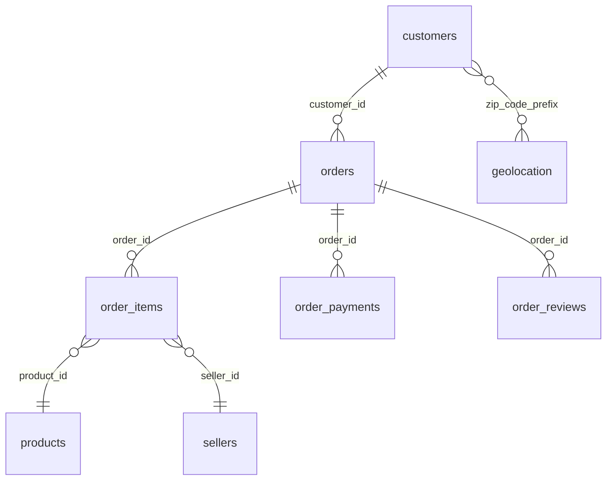

# Dataset Olist — carte d'identité (exploration phase 1.1, 2026-07-21)

Dataset : [Brazilian E-Commerce Public Dataset by Olist](https://www.kaggle.com/datasets/olistbr/brazilian-ecommerce)
(~120 Mo, 9 CSV, déposés manuellement dans `data/olist/` — gitignoré, cf. ADR 009).
Commandes réelles d'une marketplace brésilienne, anonymisées.

## Modèle de données

Une **commande** (`orders`) appartient à un client, contient des lignes d'articles
(`order_items`), est réglée par un ou plusieurs paiements (`order_payments`) et peut
recevoir un avis (`order_reviews`). `geolocation` relie les préfixes de code postal
aux villes/coordonnées (plusieurs lignes par préfixe).

## Les 9 tables

| Table | Lignes | Clé | Notes |
|---|--:|---|---|
| `orders` | 99 441 | `order_id` | 8 statuts (97 % `delivered`) ; 4 timestamps de livraison |
| `order_items` | 112 650 | `order_id`+`order_item_id` | `order_item_id` = n° de ligne (1–21), pas un ID |
| `order_payments` | 103 886 | `order_id`+`payment_sequential` | 5 types ; `payment_value` = future cible d'injection (renommage J45) |
| `customers` | 99 441 | `customer_id` | `customer_unique_id` (96 096) = la personne ; `customer_id` = 1 par commande |
| `products` | 32 951 | `product_id` | dimensions/poids, catégorie |
| `geolocation` | 1 000 163 | — (pas de clé) | 1 ligne par point GPS ; porte le fil rouge sémantique |
| `sellers` | 3 095 | `seller_id` | ville/état du vendeur |
| `order_reviews` | 99 224 | `review_id` | beaucoup de texte libre |
| `product_category_name_translation` | 71 | `product_category_name` | utilitaire pt→en |

**Intégrité référentielle mesurée : 100 %** sur les 4 liens principaux
(orders→customers, items→orders, items→products, payments→orders).
775 commandes sans item (annulées/indisponibles) — normal.

## Nulls naturels (à ne pas confondre avec les injections !)

| Colonne | Nulls | Interprétation |
|---|--:|---|
| `order_reviews.review_comment_title` | 88,3 % | titre d'avis facultatif |
| `order_reviews.review_comment_message` | 58,7 % | message facultatif |
| `orders.order_delivered_customer_date` | 3,0 % | commandes non livrées (en cours/annulées) |
| `orders.order_delivered_carrier_date` | 1,8 % | idem, plus tôt dans le tunnel |
| `products.product_category_name` + 3 colonnes | 1,9 % | produits mal renseignés |
| `orders.order_approved_at` | 0,2 % | paiements jamais approuvés |

Ces taux sont la **base de référence** : l'agent devra les apprendre comme « normaux ».
L'injection de nulls (J60/J85) devra viser une colonne *naturellement pleine*
(ex. `customer_id`) pour être détectable sans ambiguïté.

## Couverture temporelle

Commandes du **2016-09-04 au 2018-10-17** (`order_purchase_timestamp`), mais les
bords sont quasi vides (sept. 2016 : 4 ; oct. 2018 : 4). Volume utile : 2017-01 →
2018-08, croissance de ~800 à ~7 000 commandes/mois, pic Black Friday nov. 2017
(7 544), plateau stable mars–août 2018 (~6 200–7 200/mois ≈ 210–240/jour).

## Fil rouge sémantique (mesuré, cf. ADR 009)

`geolocation_city` : 8 011 villes distinctes, dont **135 800 `sao paulo` /
24 918 `são paulo` / 2 `sãopaulo`** → tout agrégat par ville éclate São Paulo
en plusieurs lignes (85/15). Cas réel, aucune injection nécessaire.
(`customer_city`, elle, est déjà normalisée : 4 119 villes, pas de variantes accentuées.)

## Sous-ensemble retenu pour le pipeline (décision phase 1.1)

**Retenues (6)** : `orders`, `order_items`, `order_payments`, `customers`,
`products`, `geolocation` — le cœur transactionnel + le porteur du fil rouge.

**Écartées (3)** :
- `order_reviews` : texte libre volumineux, nulls naturels massifs (88 %) qui
  brouilleraient le profilage de complétude ; aucun objectif ne l'exige.
- `sellers` : n'apporte ni volume ni cas de qualité ; la dimension géographique
  est déjà couverte par customers/geolocation.
- `product_category_name_translation` : utilitaire d'affichage, pas une donnée
  métier ; pourra servir au dashboard sans passer par le pipeline.

## Fenêtre de rejeu (décision phase 1.2)

**2018-03-01 → 2018-05-31 (92 jours)** : le plateau le plus stable du dataset
(mars 7 211, avril 6 939, mai 6 873 commandes ; ~230/jour), sans pic saisonnier —
un « normal » propre pour le profilage, où les anomalies injectées ressortiront
nettement. Jours d'injection (J1 = 2018-03-01) : J45 = 2018-04-14, J60 = 2018-04-29,
J75 = 2018-05-14, J80 = 2018-05-19, J85 = 2018-05-24.
